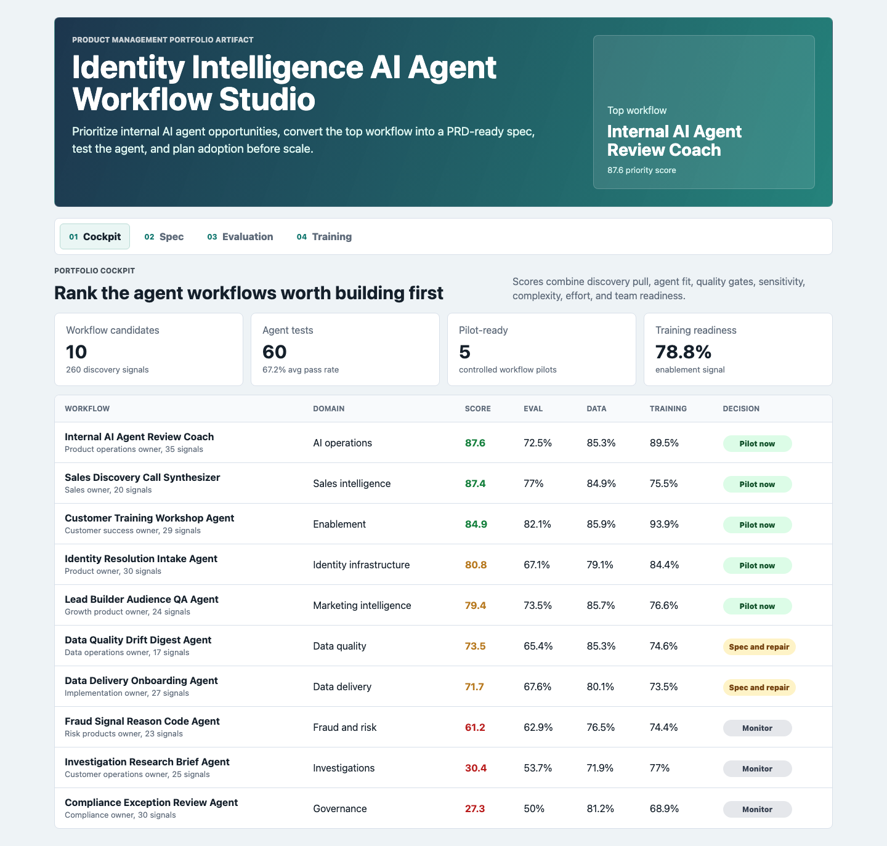
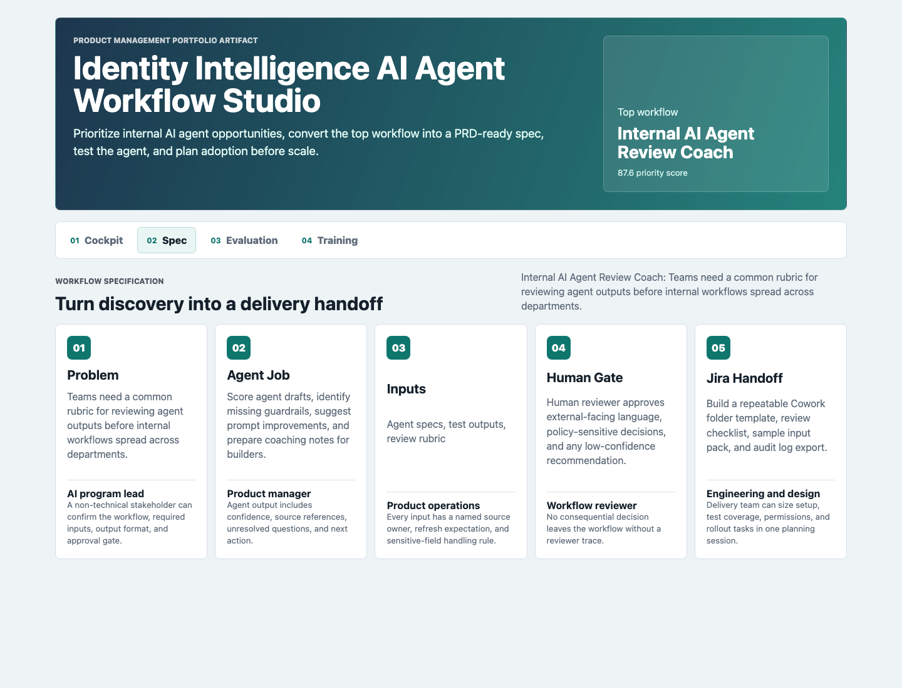
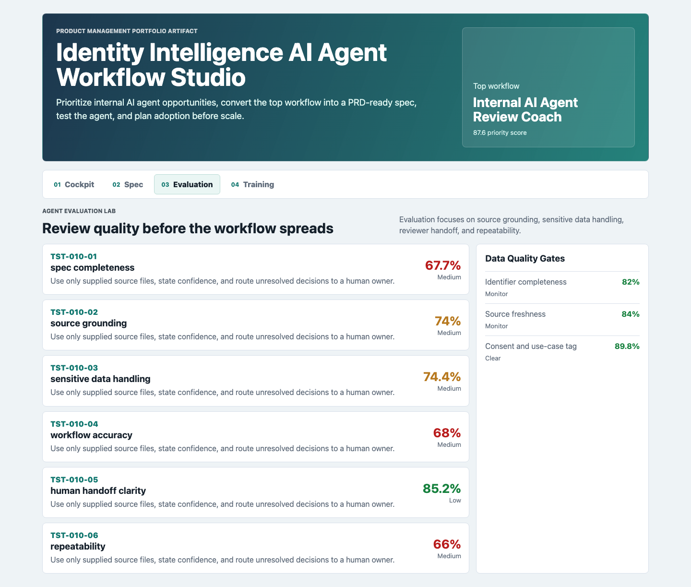
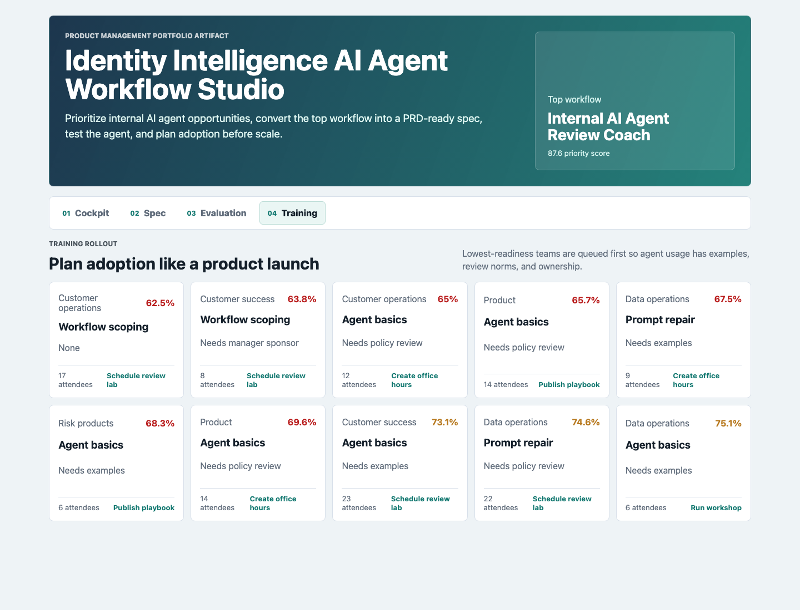

# Identity Intelligence AI Agent Workflow Studio

An interactive product management portfolio artifact for an identity intelligence and data analytics platform team. The studio shows how a product manager can discover internal AI agent opportunities, convert the best one into a workflow specification, evaluate agent quality, and plan training before scaling adoption.

## What This Project Shows

Identity-data organizations do not need random internal agents. They need repeatable agent workflows with clear inputs, human review gates, quality checks, and training. This artifact demonstrates that product loop:

- Prioritize agent workflows by stakeholder pain, automation fit, adoption pull, data sensitivity, process complexity, effort, evaluation quality, data readiness, and training readiness.
- Translate discovery into a PRD-ready workflow specification with source systems, acceptance criteria, reviewer gates, and delivery handoff.
- Review agent outputs with a test matrix for source grounding, sensitive data handling, workflow accuracy, human handoff clarity, and repeatability.
- Plan internal workshops so teams adopt the agent workflow safely and consistently.

## Screenshots



Caption: The priority cockpit ranks identity intelligence AI agent opportunities and shows whether each workflow should pilot, enter prompt and spec repair, run discovery, or stay monitored.



Caption: The workflow spec surface turns the top-ranked agent into a PRD-ready handoff with problem framing, agent job, input pack, human gate, and Jira-style delivery criteria.



Caption: The evaluation lab shows agent test cases, pass rates, defect severity, data quality gates, and reviewer notes before the workflow can be expanded.



Caption: The training rollout surface identifies the teams and modules that need workshops, examples, policy review, or office hours before broad adoption.

## Data Strategy

All data is deterministic synthetic data generated for a public portfolio artifact. It does not represent real customers, people, identity records, lead lists, fraud signals, investigations, contracts, employees, internal tools, or production company performance.

The generator uses fixed seed `5262026`. The synthetic structure is modeled on common identity intelligence operating patterns: identity resolution, fraud and risk reason codes, contact enrichment, lead audience QA, investigations research, data delivery onboarding, compliance exception review, data quality drift, sales discovery, and internal AI agent review.

The scoring model combines stakeholder signal volume, pain, urgency, requirements clarity, automation fit, adoption pull, data sensitivity, process complexity, delivery effort, agent evaluation pass rate, data quality pass rate, and training readiness.

## Files

- `index.html`: Static app shell with four product artifact surfaces.
- `src/app.js`: Loads the generated app payload and renders the cockpit, workflow spec, evaluation lab, and training rollout.
- `src/styles.css`: Responsive product-studio styling.
- `scripts/score_operating_data.py`: Regenerates synthetic data, analysis outputs, documentation, and app payload.
- `scripts/capture_screenshots.cjs`: Captures README screenshots.
- `data/`: Synthetic source-style datasets.
- `analysis/outputs/`: Ranked workflow queue, PRD spec, evaluation matrix, training plan, summary, and app payload.

## Role Connection

This artifact demonstrates product management for agentic AI work: discovery conversations, cross-functional prioritization, structured workflow specification, hands-on agent review, human approval gates, Jira-ready handoff, and internal training. It is intentionally more than a dashboard because the job is about building and scaling useful AI agent workflows across teams.

## Run Locally

```bash
npm run analyze
npm run start
```

Then open `http://localhost:4173`.

## Scope

This is a static public portfolio artifact with reproducible synthetic data and transparent scoring logic. It does not connect to live identity data, production APIs, Snowflake, cloud storage, CRM systems, support queues, fraud tools, lead platforms, investigation products, AI services, Claude Cowork, Jira, or private company data. It shows how a product manager can structure the evidence, decisions, review gates, and enablement plan for internal AI agent workflows before production implementation.
